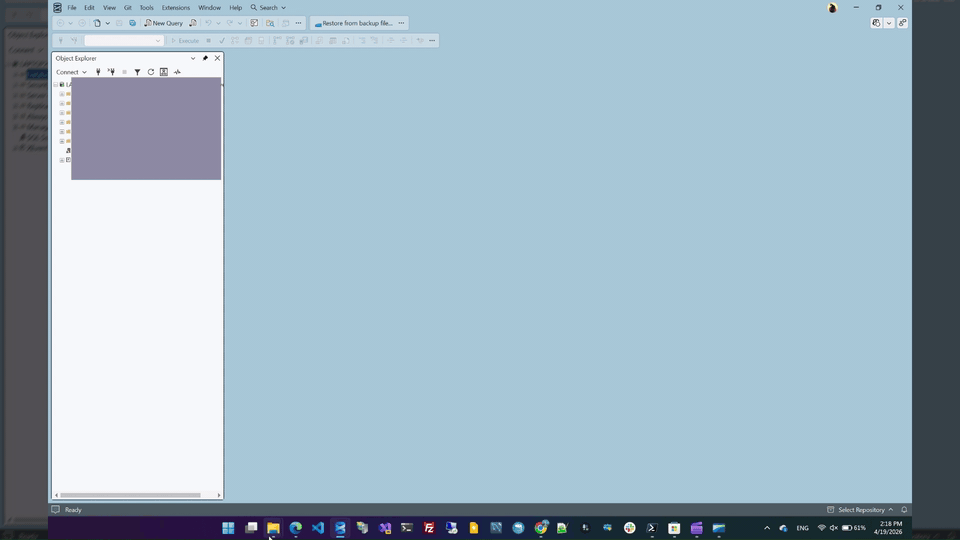

# SSMS Quick Restore

A Visual Studio extension (VSIX) for **SQL Server Management Studio 21 and 22** that reduces a
database restore from ~8 clicks to one.

## Demo



<sub>Prefer the full-resolution video? [Download the MP4](docs/SSMS_Quick_Restore.mp4).</sub>

## Features

- **Toolbar button + Tools menu item**: "Restore from backup file..."
- **Drag-and-drop**: drop a `.bak` or `.trn` onto the SSMS window to open the dialog instantly
- **Restore dialog** with:
  - Multi-file support (striped backups)
  - Server connection dropdown pre-filled from Object Explorer
  - Ad-hoc connect dialog (Windows or SQL authentication)
  - Backup-set picker (RESTORE HEADERONLY)
  - Auto-filled file-relocation grid (RESTORE FILELISTONLY + server default paths)
  - Options: REPLACE (default on), NORECOVERY, STANDBY, KEEP_CDC, close existing connections, take tail-log backup
  - **Script** button: generates RESTORE T-SQL into the embedded output pane
  - **Restore** button: executes via SMO with live percent progress and timestamped log lines
  - **Copy / Clear** buttons on the output pane
- **Dual logging**: SSMS Output window pane + rolling file at
  `%APPDATA%\SsmsQuickRestore\Logs\SsmsQuickRestore_YYYYMMDD.log`

## Requirements

| Requirement | Version |
|---|---|
| SQL Server Management Studio | 21 or 22 |
| .NET Framework | 4.8 (installed with SSMS) |
| Windows | 10 / 11 |

## Installation

### Recommended: use the installer

1. Download `SsmsQuickRestore-Setup-1.1.0.exe` from the [Releases](../../releases/latest) page.
2. Close SSMS if it is running.
3. Right-click the .exe and choose **Run as administrator** (writing to `Program Files`
   requires elevation).
4. Click through Welcome -> License -> Install. The installer:
   - Auto-detects SSMS 22 / 21 install paths (default location + registry fallback)
   - Refuses to continue if SSMS isn't found and offers a download link
   - Copies the extension to `<SSMS>\Common7\IDE\Extensions\SsmsQuickRestore\`
   - Runs `Ssms.exe /updateconfiguration` so SSMS rebuilds its pkgdef cache
5. Launch SSMS. The toolbar button and **Tools -> Restore from backup file...** menu item appear.

### Uninstall

Settings -> Apps -> "SSMS Quick Restore" -> Uninstall, or run `unins000.exe` from the install
folder. The uninstaller removes the files and refreshes the SSMS configuration automatically.

### Manual install (advanced)

If you prefer not to run the installer, download `SsmsRestoreDrop.vsix` from the
[Releases](../../releases/latest) page and deploy it manually:

1. Close SSMS if it is running.
2. Open **PowerShell as Administrator** and run:

   ```powershell
   $vsix    = 'C:\path\to\SsmsRestoreDrop.vsix'
   $extDir  = 'C:\Program Files\Microsoft SQL Server Management Studio 22\Release\Common7\IDE\Extensions\SsmsQuickRestore'
   $ssmsExe = 'C:\Program Files\Microsoft SQL Server Management Studio 22\Release\Common7\IDE\Ssms.exe'

   # Extract the VSIX (it is a ZIP archive)
   Add-Type -AssemblyName System.IO.Compression.FileSystem
   $tmp = Join-Path $env:TEMP 'SsmsQuickRestore_Extract'
   if (Test-Path $tmp) { Remove-Item $tmp -Recurse -Force }
   [System.IO.Compression.ZipFile]::ExtractToDirectory($vsix, $tmp)

   # Copy into the SSMS Extensions folder
   New-Item -ItemType Directory -Force -Path $extDir | Out-Null
   Copy-Item "$tmp\*" $extDir -Recurse -Force

   # Patch the pkgdef so SSMS can locate the DLL via $PackageFolder$
   $pkgdef = Join-Path $extDir 'SsmsRestoreDrop.pkgdef'
   $c = [System.IO.File]::ReadAllText($pkgdef, [System.Text.Encoding]::Unicode)
   $c = $c -replace '"Assembly"="[^"]+"', '"CodeBase"="$PackageFolder$\SsmsRestoreDrop.dll"'
   [System.IO.File]::WriteAllText($pkgdef, $c, [System.Text.Encoding]::Unicode)

   # Refresh SSMS pkgdef cache
   & $ssmsExe /updateconfiguration | Out-Null
   ```

For SSMS 21, replace the path prefix accordingly. To uninstall manually, close SSMS, delete the
`Extensions\SsmsQuickRestore` folder, and run `Ssms.exe /updateconfiguration` once.

## Usage

### Toolbar / menu

1. Click **Restore from backup file...** in the toolbar, or **Tools -> Restore from backup file...**.
2. Pick one or more `.bak`/`.trn` files in the file picker.
3. In the Restore dialog:
   - Confirm or change the **server connection** (defaults to the active Object Explorer node).
   - Edit the **target database name** (defaults to the name from the backup header).
   - Pick the **backup set** (relevant when a file contains multiple sets).
   - Adjust **file relocation paths** if the destination differs from the source.
   - Toggle **options** (REPLACE is checked by default).
4. Click **Script** to view the T-SQL in the output pane, or **Restore** to execute.
5. Watch progress live in the output pane and the progress bar.
6. After success, choose **Yes** to close, or **No** to keep the dialog open and review the log.

### Drag-and-drop

Drag one or more `.bak`/`.trn` files from Windows Explorer onto the SSMS window.
The Restore dialog opens with the files pre-filled.

## Building from source

### Prerequisites

- .NET SDK (any recent 8.x or later) for `dotnet build`
- Visual Studio 2022 with the **Visual Studio extension development** workload, *or* the bundled
  `Microsoft.VSSDK.BuildTools` NuGet package (referenced by the project)
- SSMS 21 or 22 installed (the build references SMO + SqlWorkbench DLLs from the SSMS install dir
  to guarantee version match)

### Build

```powershell
# From the repo root
dotnet build src\SsmsRestoreDrop.csproj -c Release `
    -p:DeployExtension=false -p:DeployVsixExtensionFiles=false
```

Build artifacts (DLL, pkgdef, vsixmanifest, Resources) land in
`src\bin\Release\net48\`. The packaged `.vsix` is built when the VSSDK targets are present.

### One-shot build + deploy

`deploy.ps1` builds Release, patches the pkgdef to use `CodeBase`, copies everything to
`Extensions\SsmsQuickRestore`, and runs `Ssms.exe /updateconfiguration`. Run it from an
Administrator PowerShell prompt:

```powershell
.\deploy.ps1
```

### Custom SSMS install path

If SSMS is installed somewhere other than the default path, set `SsmsInstallDir` in
`Directory.Build.props` or pass it on the command line:

```powershell
dotnet build src\SsmsRestoreDrop.csproj -c Release `
    -p:SsmsInstallDir="D:\SSMS22\Common7\IDE\"
```

### Build the installer

The installer script lives in `installer/SsmsQuickRestore.iss`. Build with the bundled
PowerShell wrapper (requires Inno Setup 6 in `C:\Program Files (x86)\Inno Setup 6\`):

```powershell
powershell -ExecutionPolicy Bypass -File installer\build-installer.ps1
```

The script builds the project in Release, patches the generated pkgdef
(`Assembly` -> `CodeBase`), and produces
`installer\Output\SsmsQuickRestore-Setup-<version>.exe`.

### Run tests

```powershell
dotnet test tests\SsmsRestoreDrop.Tests.csproj `
    -c Release --filter "TestCategory!=Integration"
```

Integration tests (require a real SQL Server and a `.bak` file):

```powershell
$env:SSMS_TEST_CONN = "Server=.\SQLEXPRESS;Integrated Security=true"
$env:SSMS_TEST_BAK  = "C:\path\to\your.bak"
dotnet test tests\SsmsRestoreDrop.Tests.csproj
```

## Architecture

```
src/
  SsmsRestoreDropPackage.cs          AsyncPackage entry point (ProvideAutoLoad on shell init)
  SsmsRestoreDrop.vsct               Command table (toolbar + Tools menu item)
  Commands/
    PackageGuids.cs                  GUIDs and command IDs
    RestoreFromFileCommand.cs        OleMenuCommand -> OpenFileDialog -> RestoreDialog
  Services/
    SsmsConnectionService.cs         Active Object Explorer connection via reflection
    BackupInspector.cs               RESTORE HEADERONLY / FILELISTONLY via SMO
    RestoreRunner.cs                 SMO Restore with PercentComplete / Information events
    RestoreOptions.cs                Option and progress data classes
  UI/
    RestoreDialogViewModel.cs        MVVM ViewModel, async backup-info loading
    RestoreDialog.xaml(.cs)          WPF restore dialog with embedded output pane
    ConnectDialog.xaml(.cs)          Ad-hoc SQL Server connect dialog
    ProgressToolWindow.cs            Dockable ToolWindowPane (legacy, no longer shown)
  DropHandler/
    BakFileDropTarget.cs             WPF PreviewDrop on Application.MainWindow
  Logging/
    Logger.cs                        Output-window pane + rolling log file
tests/
  BackupInspectorTests.cs            Unit and integration tests (MSTest)
deploy.ps1                           Build + deploy to SSMS Extensions folder
```

## Notes and limitations

- **No formal SSMS extension SDK**: SSMS 21+ accepts VSIX packages but Microsoft has not published a
  stable extensibility SDK. This extension follows patterns from established community extensions.
  It may need adjustment if Microsoft changes the SSMS shell internals.
- **SMO version**: the build references SMO directly from the SSMS install dir so the assembly
  version always matches what SSMS loads at runtime (the SMO NuGet package lags the SSMS-internal
  SMO version).
- **Object Explorer integration**: the active connection is resolved via runtime reflection on
  `SqlWorkbench.Interfaces.dll`. If reflection fails, the ad-hoc Connect dialog still works.
- **Backup sources**: local disk and UNC share only. Azure Blob and S3 are out of scope.
- **Azure Data Studio**: out of scope (different extension model).

## Contributing

Issues and pull requests are welcome. Before opening a PR:

1. Run the unit tests (`dotnet test ... --filter "TestCategory!=Integration"`).
2. Verify your change builds against an actual SSMS install (`deploy.ps1`).
3. Keep user-facing strings ASCII (no em-dashes, ellipses, or smart quotes).

## License

MIT - see [LICENSE](LICENSE).
